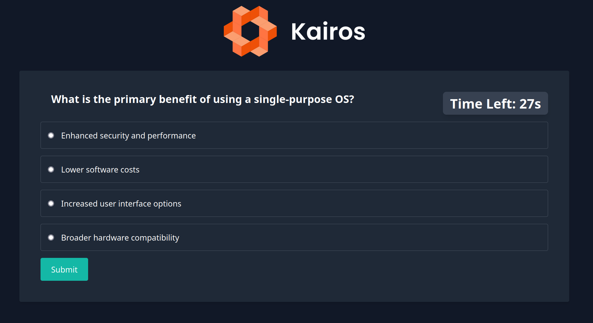

This is an application that builds quizzes. Can be used in conferences or other events.

It's still work in progress but already usable.



All you need it to create a yaml file with the possible questions (see the test
file as an example: [test questions.yaml](tests/assets/question_pool.yaml))

Then you need to generate a secret that will sign the cookies. E.g. with:

```bash
export QUIZMAKER_COOKIE_SECRET=$(openssl rand -base64 32)
```

then run the application with golang:

```bash
go run . -question-pool questions.yaml
```

NOTE: This application started as part of the [Kairos.io](https://kairos.io/) team hackweek.

TODO:

- Finalize the question pool
- make it configurable so other teams can use their own logo and text
- create an easy way to collect results
- create an easy deployment method (kustomization / helm chart / other)
- Test in Kairos kiosk mode and create the relevant helper files
- Create endpoint that shows the currently active quizzes
- improve the README
- Create a leaderboard with aliases (not their emails). This way we can give prizes to 1st/2nd/3rd etc
- When showing leaderboard, check if any pending sessions are now expired (recalculate the fields), because currently we recalculate the fields only when a question is answers. Abandoned quizzes will show as "in progress" forever this way.
